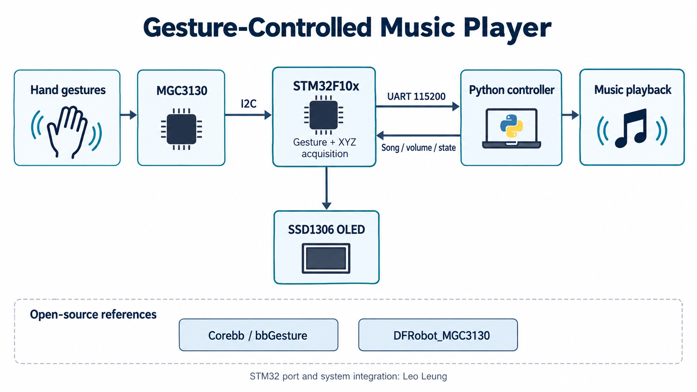
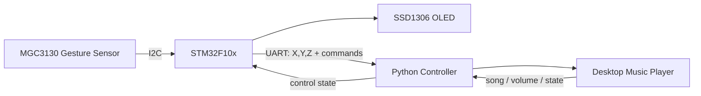

# Gesture-Controlled Music Player

> An embedded-system course project by **Leo Leung**, combining STM32 gesture sensing with a PC-side music player.



## Overview

This project connects an STM32F10x-based controller to a desktop music player. The embedded side reads gesture and 3D position data from an **MGC3130** gesture sensor, displays device status on an OLED, and exchanges control/status data over UART. A Python controller on the PC side receives sensor data, maps gestures to playback actions, and sends song information and control state back to the MCU.

## What it demonstrates

- STM32F10x firmware development with the Standard Peripheral Library
- MGC3130 gesture sensing over I2C
- Gesture and X/Y/Z position acquisition
- UART serial communication at 115200 baud
- Modbus-style register mapping for gesture, volume, current song, and song name
- SSD1306 OLED display integration
- PC-side Python music playback/controller logic
- Embedded + desktop application integration

## Gesture mapping

| Gesture | Action |
| --- | --- |
| Left | Previous song |
| Right | Next song |
| Up | Volume up |
| Down | Volume down |
| Clockwise circle | Pause / resume in the current Python controller |
| Counter-clockwise circle | Pause / resume in the current Python controller |

The firmware register labels still describe the circle commands as single-song / playlist loop. The PC controller currently routes both to `toggle_pause()`. This table describes the implemented PC behavior; the firmware labels and PC semantics need alignment before a hardware demo.

## System flow



## Repository structure

```text
GestureControl-based-STM32-/
├── App/
│   ├── Main/          # Main loop and periodic task scheduling
│   ├── OLED/          # OLED display
│   └── ...
├── HW/
│   ├── Gesture/       # MGC3130 driver
│   └── Modbus/        # Register/protocol handling
├── FW/                # STM32 standard peripheral library
├── ARM/               # Interrupt/timing helpers + CMSIS / startup / system files
├── Project/           # Debug configurations and historical build outputs
└── music_player_controller.py
```

## Hardware, firmware and PC controller

| Layer | Implementation |
| --- | --- |
| Sensor | MGC3130; gesture and X/Y/Z acquisition over hardware I2C |
| MCU | STM32F10x; initialization, periodic work, UART and register handling |
| Display | SSD1306 OLED for device and playback status |
| PC | Python controller; serial reception, gesture mapping, pygame playback and optional Windows volume control |
| Return path | Modbus-style registers for control, volume, song index and song text |

## Getting started

The firmware requires compatible STM32 hardware, an MGC3130 sensor, an OLED and a serial connection. Review pin assignments in `HW/Gesture`, `HW/UART1` and `App/OLED` before wiring. This snapshot does not contain a `.uvproj` / `.uvprojx` project file; firmware building requires the original Keil project or a configured project using the included sources.

For the PC side, install the required serial and playback packages:

```bash
python -m pip install pyserial pygame
```

On Windows, optional system-volume control uses `pycaw` and `comtypes`:

```bash
python -m pip install pycaw comtypes
```

Put supported audio files in the `Music` folder beside the script and choose the actual serial port:

```bash
python music_player_controller.py COM11 115200
```

`COM11` is the script default, not a requirement for your device. The architecture image is an explanation of the code, not a photograph or proof of a new hardware run.

## Open-source references and acknowledgements

This project was developed by **Leo Leung** and includes a substantial STM32-side port and secondary implementation based on open-source references.

The MGC3130 gesture-sensing workflow references **[Corebb / RealCorebb's bbGesture](https://github.com/RealCorebb/bbGesture)**. The bbGesture project provides hardware design resources, Arduino examples, PC tools, and an MGC3130 library adapted from DFRobot.

The upstream MGC3130 library is **[DFRobot_MGC3130](https://github.com/DFRobot/DFRobot_MGC3130)**, originally credited by DFRobot to **Yangfeng (Feng Yang)** and released under the MIT License.

Based on these references, **Leo Leung** ported and reworked the workflow for the STM32F10x platform and implemented the embedded-system integration, including:

- hardware I2C communication with the MGC3130;
- sensor reset and data-ready handling;
- gesture and X/Y/Z position acquisition;
- UART communication between the MCU and PC;
- OLED status display;
- playback-control state handling;
- PC-side music-controller interaction.

STM32 Standard Peripheral Library and CMSIS components remain third-party vendor dependencies and retain their original authorship and licensing.

## Notes

Some generated Keil build artifacts remain in the historical project tree. New work should avoid committing generated build outputs.

## Author

**Leo Leung**  
Biomedical Engineering · Embedded Systems · AI Tools
